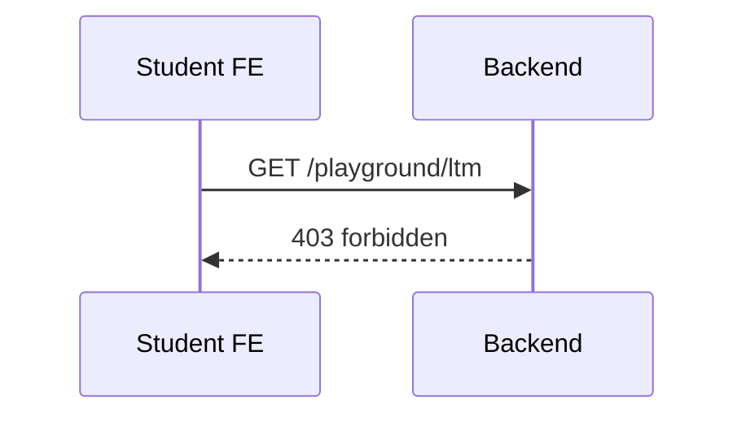

# 前端 API 文档（Next.js 前端使用说明）

说明：本文件描述前端在 `web/src/services` 目录下封装的 API 使用方式，与后端 `docs/api.md` 对齐。

## 约定
- 所有请求基于 `NEXT_PUBLIC_API_BASE_URL`。
- 统一 HTTP 封装位于 `src/services/http.ts`（超时、错误统一抛出 `ApiError`）。

---

## 认证与当前用户
- POST /auth/direct-login → 白名单直登（默认登录方式）
- POST /auth/request-code → 请求验证码（备用）
- POST /auth/verify-code → 校验验证码、获取 token（备用）
- GET /me → 当前用户信息（返回 `roles/classScopes` 等增强信息）

---

## 会话（src/services/api/sessions.ts）
- startSession({ visitorInstanceId, auto? }) → POST `/sessions/start` → `{ sessionId, sessionNumber }`
- appendMessage(sessionId, speaker, content) → POST `/sessions/{id}/messages` → `{ ok, aiResponse? }`
- finalizeSession(sessionId, assignment?) → POST `/sessions/{id}/finalize` → `{ diary }`
- getLastSession(visitorInstanceId) → GET `/sessions/last` → `{ sessionId, sessionNumber, chatHistory, finalizedAt? } | null`
- listSessions(visitorInstanceId, page?, pageSize?, includePreview=true) → GET `/sessions/list`
  - 返回字段：`messageCount/hasDiary/hasActivity/hasThoughtRecord/lastMessage?`
- getSessionDetail(sessionId) → GET `/sessions/{id}` → 详情
- prepareNewSession(sessionId) → POST `/sessions/{id}/prepare`（回退用途）
- ensureSessionOutputs(sessionId) → POST `/sessions/{id}/ensure-outputs`（开始新对话前轮询校验）
 - resetSession(sessionId, mode='auto'|'soft'|'hard') → POST `/sessions/{id}/reset` → `{ ok, mode }`
  - 学生端改为“基于作业包窗口”的绝对时间规则：
    - 必须存在“第 N 次作业包（homework_sets）”，并且当前时间在 `studentStartAt ~ studentDeadline` 之间，才能开始第 N 次会话。
    - 错误码：`package_missing` | `package_window_closed` | `cooldown_recent_created` | `session_unfinished`。
    - 仍保留 1 小时冷却与“未完成阻断”。
  - 新增：getVisitorTemplate(visitorInstanceId) → GET `/visitor/template` → `{ name, templateKey, brief }`（用于在会话页显示模板简介）。
  - 新增：getStudentOutputs(visitorInstanceId) → GET `/student/outputs` → 返回 `{ diary[], activity[], homework[], ltm: { current, history[] } }`（供学生“查看产出”使用）。

示例
```ts
// 1) 开始会话（带错误码映射）
try {
  const { sessionId } = await startSession({ visitorInstanceId });
} catch (e: any) {
  const code = e?.code;
  if (code === 'student_not_open_yet') toast('本周对话尚未开放');
  else if (code === 'student_locked_for_week') toast('本周对话窗口已结束');
  else if (code === 'weekly_quota_exhausted') toast('本周名额已用完');
  else if (code === 'cooldown_recent_created') toast('请稍后再开始下一次对话');
  else if (code === 'session_unfinished') router.push('/dashboard/conversation?history=unfinished');
  else toast(e?.message || '创建对话失败');
}

// 2) 发送消息
const r = await appendMessage(sessionId, 'user', input);
setMessages((prev) => [...prev, r.aiResponse && r.aiResponse]);

// 3) 结束会话
await finalizeSession(sessionId, assignmentText);

// 4) 读取模板 brief
const tpl = await getVisitorTemplate(visitorInstanceId);
setTemplateBrief(tpl?.brief || '');

// 5) 学生查看产出
const outputs = await getStudentOutputs(visitorInstanceId);
setDiary(outputs.diary);
setActivity(outputs.activity);
setHomework(outputs.homework);
setLtm(outputs.ltm);
```

---

## 学习档案（src/services/api/assignments.ts & homeworkSets.ts & homeworkSubmissions.ts）
- getAssignmentsList(visitorInstanceId) → GET `/assignments/list` → `{ items: [{ sessionId, sessionNumber, createdAt, homework[], thoughtRecordCount, chatCount }] }`
- getHomeworkSetBySession(sessionId) → GET `/homework/sets/by-session` → `{ item }`
- createHomeworkSubmission({ sessionId, homeworkSetId, formData }) → POST `/homework/submissions` → `{ ok, id }`（仅一次提交）
- 重复提交将返回 409：`{ error: 'conflict', code: 'submission_exists' }`
- getHomeworkSubmission(sessionId) → GET `/homework/submissions` → `{ item }`
 - updateHomeworkSubmission(sessionId, formData) → PUT `/homework/submissions` → `{ ok, id, updated: true }`
- getDashboardTodos(visitorInstanceId) → GET `/dashboard/todos` → `{ items, summary }`
  - 说明：Dashboard 的“本周对话/第 N 次作业”待办仅在存在对应的作业包时出现，并且 `dueDate = homework_sets.studentDeadline`。

---

## 助教（技术）（src/services/api/assistant.ts）
- getAssistantVisitors() → GET `/assistant/visitors`
- getStudentsByVisitor(visitorInstanceId) → GET `/assistant/students`
- getAllAssistantStudents() → GET `/assistant/all-students`
- getStudentSessions(studentId) → GET `/assistant/students/{id}/sessions`
- getStudentHistory(studentId) → GET `/assistant/students/{id}/history`
- 助教聊天（统一替代旧 questions/feedbacks）：
  - listAssistantChat(sessionId, page?, pageSize?) → GET `/assistant/chat` → `{ items, unreadCount, page, pageSize, total }`
  - sendAssistantChat({ sessionId, content }) → POST `/assistant/chat` → `{ id }`
  - markAssistantChatRead(sessionId) → POST `/assistant/chat/read` → `{ ok: true }`
- getAssistantDashboardStats() → GET `/assistant/dashboard-stats`（包含 `unreadMessages`）
- getUnreadMessageSessions() → GET `/assistant/unread-message-sessions`
- getPendingThoughtRecords() → GET `/assistant/pending-thought-records`（待批改作业）
- getHomeworkSubmission(sessionId) → GET `/assistant/homework/submission?sessionId=...` → `{ item | null }`
- getHomeworkDetail(sessionId) → GET `/assistant/homework/detail?sessionId=...` → `{ session, set, submission, fields }`

---

## 行政助教（src/services/api/assistantClass.ts）
- getClassStudents() → GET `/assistant-class/students`（返回扩展字段：`visitorTemplateKey/visitorTemplateName/lastSessionAt/totalSessions`）
- getClassStudentSessions(studentId) → GET `/assistant-class/students/{id}/sessions`
- getPackageCompliance() → GET `/assistant-class/compliance` → `{ items: [{ setId, sequenceNumber, title?, studentStartAt, studentDeadline, assistantStartAt, assistantDeadline, totalStudents, sessionsStarted, submissions, feedbacks }] }`
- getProgressBySession(sessionNumber) → GET `/assistant-class/progress-by-session?sessionNumber=N`（返回每位学生的 `hasSession/hasThoughtRecord/missCountUptoSession`）
- getClassHomeworkSets() → GET `/assistant-class/homework/sets`
- getHomeworkSetProgress(setId) → GET `/assistant-class/homework/sets/{id}/progress`
  - 返回：`{ items: [{ studentId, name?, userId, sessionNumber, hasSubmission, sessionDurationMinutes, assistantFeedback }] }`
  - 说明：`sessionDurationMinutes` 为该次会话完成时长（分钟，未完成 `null`）；`assistantFeedback` 为作业提交后的最新助教回复内容。
- getHomeworkSetFeedback(setId, studentId, page?, pageSize?) → GET `/assistant-class/homework/sets/{id}/feedback`
  - 返回：`{ items: [{ speaker: 'assistant'|'student', content, timestamp }], page, pageSize, total }`
  - 用于“查看对话”滑动窗口，按时间升序分页。

---

## Playground（src/services/api/playground.ts 或 assistant 内封装）
- ensurePlayground() → POST `/playground/ensure`
- listPlaygroundInstances() → GET `/playground/instances`
- getPlaygroundLtm(visitorInstanceId) → GET `/playground/ltm`
- 重要权限说明：`student` 学生角色被后端明确禁止访问所有 `/playground/*` 接口（403）。仅行政助教用户在“工作概览”不请求学生待办接口以避免 403。

时序图（学生被拒绝访问 Playground）


---

## Admin（src/services/api/assistant.ts 内封装）
- 概览：getAdminOverview() → GET `/admin/overview`
- 人员与分配：
  - getAdminUsers({ role?, status?, q?, page?, pageSize? }) → GET `/admin/users` → `{ items, page, pageSize, total }`
  - createAdminUser(body) → POST `/admin/users`
  - updateAdminUser(id, body) → PUT `/admin/users/{id}`
  - deleteAdminUser(id) → DELETE `/admin/users/{id}`
  - getAssignmentStudents(params) → GET `/admin/assignments/students`
  - assignTemplate({ studentId, templateKey }) → POST `/admin/assignments/assign-template`
  - assignAssistant({ studentId, assistantId, visitorInstanceId?, templateKey? }) → POST `/admin/assignments/assign-assistant`
  - bulkAssign({ items }) → POST `/admin/assignments/bulk`
  - getAssistantStudentsAdmin(assistantId?) → GET `/admin/assistant-students`
  - 响应扩展字段：`studentName/studentEmail/visitorName/templateKey`
  - addAssistantStudentAdmin(payload) → POST `/admin/assistant-students`
  - removeAssistantStudentAdmin(id) → DELETE `/admin/assistant-students/{id}`
- 规则与日历：
  - getAdminTimeWindow/saveAdminTimeWindow → GET/POST `/admin/policy/time-window`（页面已弱化）
  - createDdlOverride/listDdlOverrides → POST/GET `/admin/policy/ddl-override`
  - createBatchDdlOverride/listRecentDdlOverrides → POST/GET `/admin/policy/ddl-override/batch|recent`
  - getSessionOverrides/createSessionOverride/listRecentSessionOverrides → GET/POST/GET `/admin/policy/session-override[|/recent]`
- Homework 批量解锁（新增）：
  - bulkStudentOverride(setId, { action, until, reason? }) → POST `/admin/homework/sets/{id}/ddl-override/students`
  - bulkAssistantOverride(setId, { action, until, reason? }) → POST `/admin/homework/sets/{id}/ddl-override/assistants`

---

## 已移除接口（请勿使用）
- `POST/GET /questions`
- `POST/GET /assistant/feedback`

以上与后端实现一致，若新增接口会先更新本文件与 `docs/api.md` 再落地实现。
